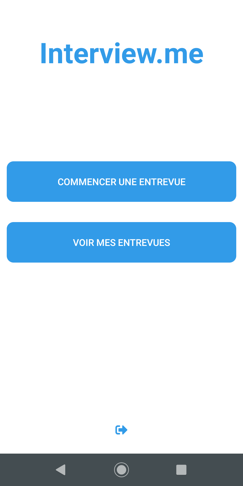
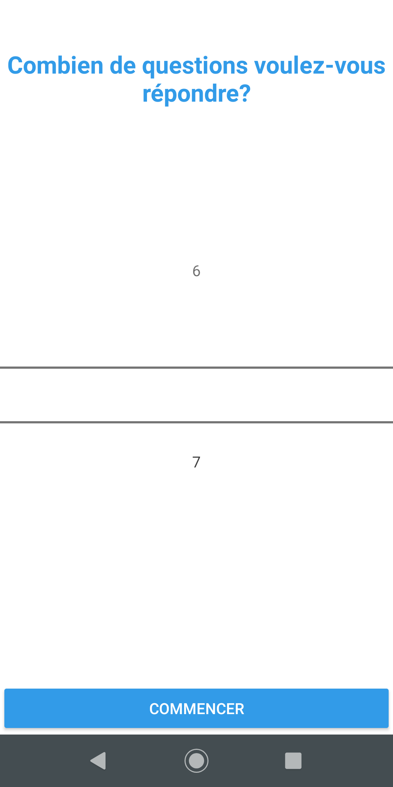
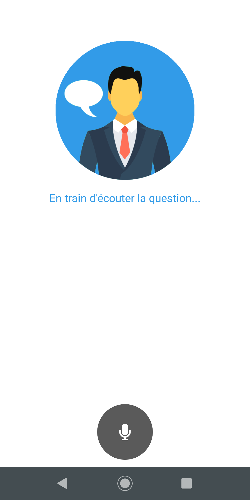
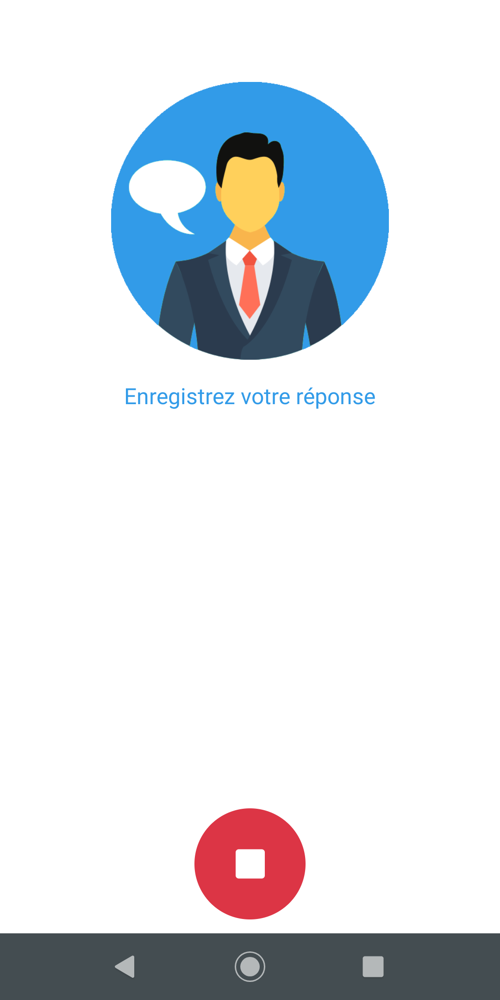
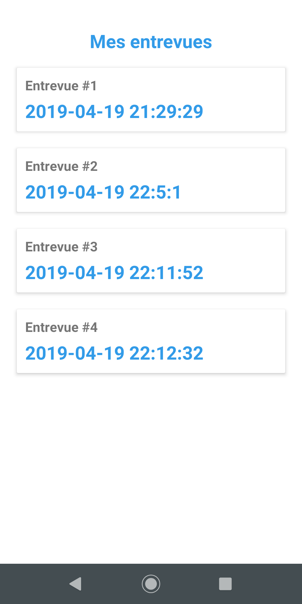
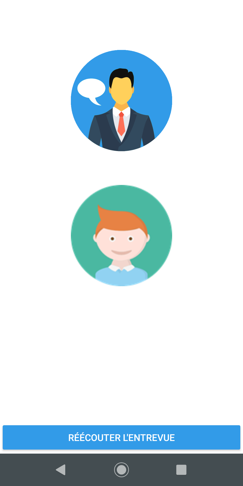

<h3 align="center">Interview.me</h3>

<h4 align="center">A mobile app for simulating job interviews in french</h4>

<p align="center">
    
    
    
    
    
    
    
</p>

---

## Usage

``` bash
# Install dependencies
npm install

# Build for production
tns build <platform> --bundle

# Build, watch for changes and debug the application
tns debug <platform> --bundle

# Build, watch for changes and run the application
tns run <platform> --bundle
```